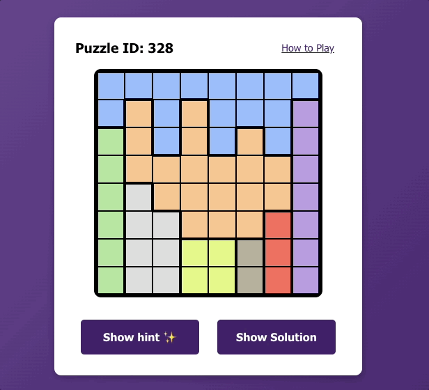

# Queens Puzzle Solver

## Purpose

I created this personal project mainly to explore the use of AI assisted coding tools, initially using Claude 3.5 in the beginning and then shifting to using Cursor.

## Background

This project solves LinkedIn's [Queens puzzle](https://www.linkedin.com/games/queens) of the day.

## Tech Stack

### Frontend

-   React 18
-   TypeScript
-   Vite
-   Testing: Vitest, React Testing Library
-   CSS for styling

### Backend

-   Python
-   FastAPI
-   Uvicorn (ASGI server)
-   Pydantic for data validation
-   Deployed as AWS Lambda function via Mangum

## Demo

