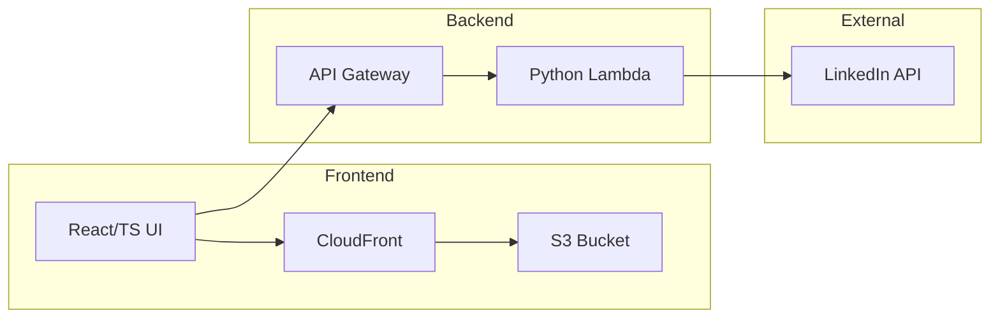
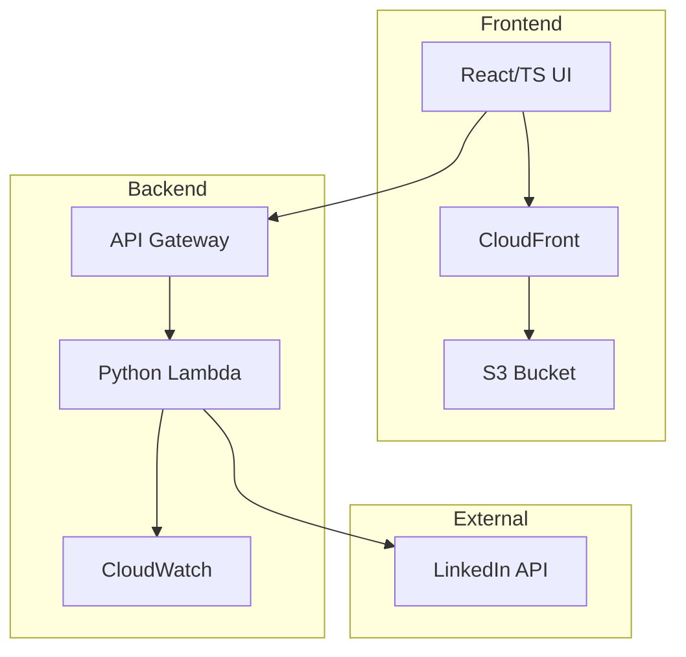
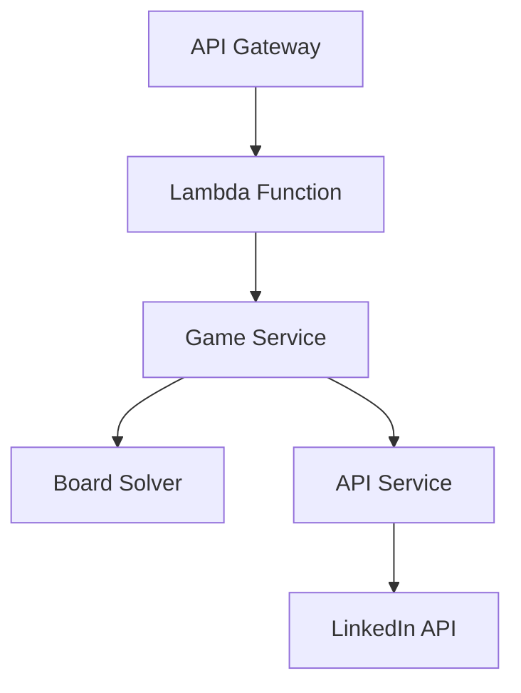
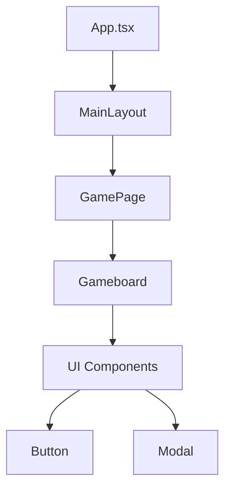

# System Patterns: Queens Solver

## System Architecture

The Queens Solver application follows a client-server architecture with clear separation of concerns:



### Key Components

1. **Frontend (React/TypeScript)**
   - User interface for displaying puzzles and solutions
   - Communicates with backend via RESTful API
   - Handles rendering of game boards and solutions
   - Deployed to AWS S3 and served via CloudFront

2. **Backend (Python/Lambda)**
   - Fetches puzzle data from LinkedIn's API
   - Processes and transforms puzzle data
   - Implements solving algorithms
   - Exposes RESTful API endpoints via API Gateway
   - Deployed as AWS Lambda function

3. **Infrastructure**
   - **CloudFront**: Content delivery network for frontend assets
   - **S3**: Static hosting for frontend application
   - **API Gateway**: RESTful API endpoint management
   - **Lambda**: Serverless function execution
   - **External Services**: LinkedIn API integration

## Key Technical Decisions

1. **Backend Technology: Python with AWS Lambda**
   - **Rationale**: Serverless architecture for cost-efficiency and scalability
   - **Benefits**: 
     - No server management
     - Pay-per-use pricing
     - Automatic scaling
     - Integration with AWS services
   - **Trade-offs**: 
     - Cold start latency
     - Execution time limits
     - Stateless architecture requirements

2. **Frontend Technology: React with TypeScript**
   - **Rationale**: Strong typing for complex game state management
   - **Benefits**: 
     - Component reusability
     - Type safety
     - Modern development experience
   - **Trade-offs**: 
     - Additional build complexity
     - Learning curve

3. **API Communication: RESTful JSON via API Gateway**
   - **Rationale**: Simplicity and wide compatibility
   - **Benefits**: 
     - Easy debugging
     - Familiar pattern
     - Built-in security features
     - Request/response validation
   - **Trade-offs**: 
     - Less efficient than binary protocols
     - Additional latency from API Gateway

4. **Solving Algorithm: Backtracking**
   - **Rationale**: Well-suited for constraint satisfaction problems
   - **Benefits**: 
     - Guaranteed solution finding
     - Memory efficient
   - **Trade-offs**: 
     - Potentially slower for large boards
     - Lambda timeout considerations

5. **Deployment Architecture: AWS Serverless**
   - **Frontend**:
     - S3 for static hosting
     - CloudFront for content delivery
     - Environment-based configuration
   - **Backend**:
     - Lambda for serverless execution
     - API Gateway for HTTP endpoints
     - CloudWatch for monitoring
   - **Benefits**:
     - Scalable infrastructure
     - Cost-effective
     - Managed services
   - **Trade-offs**:
     - Vendor lock-in
     - Cold starts
     - Stateless design requirements

## Design Patterns

1. **Service Pattern**
   - **Implementation**: Separate service modules for API interaction and game solving
   - **Purpose**: Separation of concerns, maintainability
   - **Example**: `api_service.py` and `game_service.py`

2. **Repository Pattern**
   - **Implementation**: Abstraction layer for data access
   - **Purpose**: Isolate data access logic, facilitate testing
   - **Example**: API service abstracting LinkedIn data access

3. **Strategy Pattern**
   - **Implementation**: Pluggable solving algorithms
   - **Purpose**: Allow different solving strategies without changing client code
   - **Example**: Board solver implementation

4. **Component Pattern (Frontend)**
   - **Implementation**: Reusable UI components
   - **Purpose**: Consistency, reusability, maintainability
   - **Example**: Gameboard, Button, Modal components

5. **Context Provider Pattern (Frontend)**
   - **Implementation**: React context for state management
   - **Purpose**: Avoid prop drilling, centralize state
   - **Example**: ModalContext for managing modal state

## Component Relationships

### AWS Infrastructure



### Backend Components



### Frontend Components



## Critical Implementation Paths

1. **Puzzle Retrieval Flow**
   ```
   API Gateway → Lambda → Game Service → API Service → LinkedIn API → Parse Response → Return Data
   ```

2. **Puzzle Solving Flow**
   ```
   Lambda → Game Service → Extract Board Data → Board Solver → Backtracking Algorithm → Return Solution
   ```

3. **Frontend Rendering Flow**
   ```
   CloudFront → S3 → React App → API Call → Update State → Render Gameboard → Display Solution
   ```

4. **Error Handling Path**
   ```
   Try API Call → Catch Exception → Format Error → Return Error Response → Display Error UI
   ```

## Data Flow

1. **Backend to LinkedIn**
   - Authentication request with CSRF token
   - GraphQL query to fetch puzzle data
   - Response parsing and transformation

2. **Backend to Frontend**
   - JSON response with:
     - Original board configuration
     - Board size
     - Puzzle ID
     - Solution coordinates

3. **Within Frontend**
   - API service fetches data from backend
   - Game state management via hooks
   - Component rendering based on state
   - User interaction handling

## Security Considerations

1. **API Authentication**
   - LinkedIn session cookies for API access
   - No sensitive user data stored
   - API Gateway request validation
   - Lambda execution role permissions

2. **Error Handling**
   - Sanitized error messages to prevent information leakage
   - Graceful degradation on API failures
   - CloudWatch logging and monitoring

3. **Input Validation**
   - Type checking via TypeScript (frontend) and Pydantic (backend)
   - Validation of API responses before processing
   - API Gateway request validation

4. **Infrastructure Security**
   - CloudFront SSL/TLS encryption
   - S3 bucket policies
   - API Gateway authentication
   - Lambda execution role permissions
